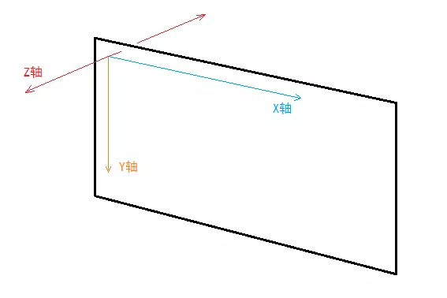

> 想必大家很厌烦笔试，因为脑海中都是一些分散的知识点，无法关联成网，一直处于时曾相识的状态。不知道多少人和我一样，至今每次写阻止冒泡都需要百度一番如何拼写。

### CSS

#### 1.盒模型

页面渲染时，dom 元素所采用的布局模型。可通过 box-sizing 进行设置。根据计算宽高的区域可分为：

- content-box (W3C 标准盒模型,在宽度和高度之外绘制元素的内边距和边框)
- border-box (为元素指定的任何内边距和边框都将在已设定的宽度和高度内进行绘制)
- inherit (从父元素继承 box-sizing 属性的值)

#### 2.层叠上下文

- z-index 属性值并不是在任何元素上都有效果。它仅在定位元素（定义了 position 属性，且属性值为非 static 值的元素）上有效果
- 判断元素在 Z 轴上的堆叠顺序，不仅仅是直接比较两个元素的 z-index 值的大小，这个堆叠顺序实际由元素的层叠上下文、层叠等级共同决定。
  
  层叠上下文通俗的讲就是，两个父元素各自有一个子元素，子元素全部设置有 position 和 z-index，那么这时候因为父元素没有设置 z-index，所以没有产生上下文，此时 z-index 谁大谁就在上面,如果两个父元素同时设置了 z-index,就算你其中子元素的 z-index 设置了 99999 也没用，因为你的父元素所产生的层叠上下文比别人的小，也就是 z-index。

#### 3.居中布局

水平居中

- 行内元素: text-align:center
- 块级元素: margin:0 auto
- absolute+transform（position: absolute;top: 50%;left: 50%;transform: translate(-50%, -50%);）
- flex+justify-content:center

垂直居中

- line-height:height
- absolute+transform
- flex+align-items:center
- display: table-cell

水平垂直居中

- absolute+transform
- flex+justify-content+align-items

#### 4.选择器优先级

- !important > 行内样式 > #id > .class > tag > \* > 继承 > 默认
- 选择器从右往左解析

#### 5.去除浮动影响，防止父级高度塌陷

- 通过增加尾元素清除浮动(::after{content:'';clear:both;display:block;})
- 父级设置高度
- 父元素设置 overflow:hidden;

### javascript

#### 1.原型 / 构造函数 / 实例

```
原型(prototype):一个简单的对象，用于实现对象的属性继承。可以简单的理解成对象的爹。在Firefox和Chrome中，
每个JavaScript对象中都包含一个 __proto__(非标准)的属性指向它爹(该对象的原型)，可obj.__proto__进行访问。
构造函数:可以通过new来新建一个对象的函数。
实例: 通过构造函数和new创建出来的对象，便是实例,实例通过 __proto__指向原型，通过constructor指向构造函数。
实例.__proto__ === 原型
原型.constructor === 构造函数
构造函数.prototype === 原型
原型.constructorr === 构造函数
```

#### 2.原型链

```
原型链是由原型对象组成，每个对象都有__proto__属性，指向了创建该对象的构造函数的原型，
__proto__将对象连接起来组成了原型链。是一个用来实现继承和共享属性的有限的对象链。
具体还是去这个网站吧https://www.jianshu.com/p/dee9f8b14771
```

#### 3.作用域

作用域其实可理解为该上下文中声明的变量和声明的作用范围。可分为块级作用域和函数作用域

- 声明提前: 一个声明在函数体内都是可见的, 函数优先于变量
- 非匿名自执行函数，函数变量为只读状态，无法修改

```
const foo = 1
(function foo() {
    foo = 10 // 由于foo在函数中只为可读，因此赋值无效
    console.log(foo)
}())
// 结果打印：  ƒ foo() { foo = 10 ; console.log(foo) }
```

#### 4.作用域链

我们可以在执行上下文中访问到父级甚至全局的变量，这便是作用域链的功劳。作用域链可以理解为一组对象列表，包含父级和自身的变量对象，因此我们便能通过作用域链访问到父级里声明的变量或者函数。

#### 5.闭包

闭包属于一种特殊的作用域，称为静态作用域。它的定义可以理解为: 父函数被销毁 的情况下，返回出的子函数仍然保留着父级的单变量对象和作用域链，因此可以继续访问到父级的变量对象，这样的函数称为闭包。
闭包也会产生一个问题：

- 多个子函数都是同时指向父级，是完全共享的。因此当父级的变量对象被修改时，所有子函数都受到影响。
  解决方法：
- 变量可以通过函数参数的形式传入
- 使用块级作用域，让变量成为自己上下文的属性，避免共享

#### 6.对象的拷贝

浅拷贝: 以赋值的形式拷贝引用对象，仍指向同一个地址，修改时原对象也会受到影响

- Object.assign
- ...扩展运算符
  深拷贝: 完全拷贝一个新对象，修改时原对象不再受到任何影响
- 当值为函数或 undefined 时，无法拷贝
- JSON.parse(JSON.stringify(obj)): 性能最快
- 递归进行逐一赋值

#### 7.new 运算符的执行过程

- 新生成一个对象
- 链接到原型 prototype
- 绑定 this
- 返回新对象

#### 8.代码的复用

- 函数封装
- 继承
- 混入 mixin 模式（感觉和继承差不多鸭）
- 借用 apply/call

#### 9.继承

在 JS 中，继承通常指的便是原型链继承，也就是通过指定原型，并可以通过原型链继承原型上的属性或者方法。

- 使用 ES6 的语法糖 class/extends

#### 10.类型转换

在 JS 中在使用运算符号或者对比符时，会自带隐式转换，规则如下:

- -、\*、/、% ：一律转换成数值后计算
- [1].toString()==='1'
- {}.toString()==='[object object]' +：
- 数字 + 字符串 = 字符串， 运算顺序是从左到右
- 数字 + 对象， 优先调用对象的 valueOf -> toString
- 数字 + boolean/null = 数字
- 数字 + undefined == NaN

#### 11.类型判断

判断类型，单单用 typeof 并无法完全满足，这其实并不是 bug，本质原因是 JS 的万物皆对象的理论。因此要真正完美判断时，我们需要区分对待

- 基本类型(null): 使用 String(null)
- 基本类型(string/number/boolean/undefined) + function: 直接使用 typeof 即可
- 其余引用类型(Array/Date/RegExpError): 调用 toString 后根据 [objectXXX]进行判断

#### 12.模块化

- es6: import/exports
- commonjs: require/module.exports/exports

require 与 import 的区别

- require 支持动态导入， import 不支持，正在提案 (babel 下可支持)
- require 是同步导入， import 属于异步导入
- require 是值拷贝，导出值变化不会影响导入值； import 指向内存地址，导入值会随导出值而变化

#### 13.防抖与节流

具体看前几篇的博客

#### 14.this 指向

要明白 this 指向，其实就是要搞清楚函数的运行环境，说人话就是，谁调用了函数。例如:

- obj.fn()，便是 obj 调用了函数，既函数中的 this===obj
- fn()，这里可以看成 window.fn()，因此 this===window

但这种机制并不完全能满足我们的业务需求，因此提供了三种方式可以手动修改 this 的指向:

- call:fn.call(target,1,2)
- apply:fn.apply(target,[1,2])
- bind:fn.bind(target)(1,2)

这三种方式在前几篇博客有详情

#### 15.ES6/ES7

- 声明:let/const: 块级作用域、不存在变量提升、暂时性死区、不允许重复声明,const: 声明常量，无法修改
- 解构赋值
- class/extend: 类声明与继承
- Set/Map: 新的数据结构
- Promise 的使用与实现,await/async

具体参考阮一峰的 es6 入门：http://es6.ruanyifeng.com/#README

#### 16.数组

- map: 遍历数组，返回回调返回值组成的新数组
- forEach: 无法 break，可以用 try/catch 中 thrownewError 来停止
- filter: 过滤
- sort(fn)/reverse: 排序与反转，改变原数组
- concat: 连接数组，不影响原数组， 浅拷贝
  .......

### 浏览器

#### 常见状态码

- 1xx: 接受，继续处理
- 200: 成功，并返回数据
- 201: 已创建
- 202: 已接受
- 203: 成为，但未授权
- 204: 成功，无内容
- 205: 成功，重置内容
- 206: 成功，部分内容
- 301: 永久移动，重定向
- 302: 临时移动，可使用原有 URI
- 304: 资源未修改，可使用缓存
- 305: 需代理访问
- 400: 请求语法错误
- 401: 要求身份认证
- 403: 拒绝请求
- 404: 资源不存在
- 500: 服务器错误

#### get / post

get: 缓存、请求长度受限、会被历史保存记录
post: 安全、大数据、更多编码类型

### 框架：Vue

#### 1.nextTick

在下次 dom 更新循环结束之后执行延迟回调，可用于获取更新后的 dom 状态

#### 2. 生命周期

- beforeCreate
- created
- beforeMount
- mounted
- beforeUpdate
- updated
- beforeDestroy
- destroyed
