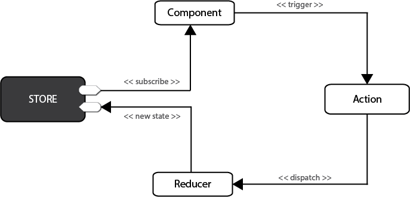
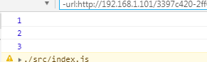

### 什么是 Redux

> Redux 是一个流行的 JavaScript 框架，为应用程序提供一个可预测的状态容器。Redux 基于简化版本的 Flux 框架，Flux 是 Facebook 开发的一个框架。在标准的 MVC 框架中，数据可以在 UI 组件和存储之间双向流动，而 Redux 严格限制了数据只能在一个方向上流动
> 

在 Redux 中，所有的数据（比如 state）被保存在一个被称为 store 的容器中 → 在一个应用程序中只能有一个。store 本质上是一个状态树，保存了所有对象的状态。任何 UI 组件都可以直接从 store 访问特定对象的状态。要通过本地或远程组件更改状态，需要分发一个 action。分发在这里意味着将可执行信息发送到 store。当一个 store 接收到一个 action，它将把这个 action 代理给相关的 reducer。reducer 是一个纯函数，它可以查看之前的状态，执行一个 action 并且返回一个新的状态。
**项目撸起来**
首先创建一个 react 脚手架项目
`create-react-app my-app`
接下来 cd 到项目当中，安装 redux
`yarn add redux -S`
页面 index.js
`import {createStore} from 'redux'`

### State

Store 对象包含所有数据， 当前时刻的 State，可以通过 store.getState()拿到。

```
//新建store
const store = createStore(reducer);
const state = store.getState();
console.log(state);
```

### Action

State 的变化，会导致页面的变化。但是，用户接触不到 State，只能接触到 View。所以，State 的变化必须是 View 导致的。Action 就是 View 发出的通知，表示 State 应该要发生变化了。Action 是一个对象。其中的 type 属性是必须的，表示 Action 的名称。其他属性可以自由设置
`const action = {type:'0'}`

### store.dispatch()

派发事件，接受 action，将当前的 action 传输给 reducer，生成新的 state
`store.dispatch(action)`

### Reducer

store 收到 action 后，经过一些逻辑计算也就是 reducer，然后生成一个新的 state

```
//通过reducer遍历
//根据老的state和action来生成新的state
function reducer(state=0,action){
    switch (action.type) {
        case '0':
            return state+1
            break;
        default:
            return state
            break;
    }
}
```

### store.subscribe()

订阅事件，一旦 State 发生变化，就自动执行这个函数

```
//订阅事件
function listener(){
    console.log(store.getState())
}
store.subscribe(listener);
```

下面直接来一个 demo 吧，index.js

```
import React from 'react';
import ReactDOM from 'react-dom';
import './index.css';
import {createStore} from 'redux';
import App from './App';
import registerServiceWorker from './registerServiceWorker';


function reducer(state=0,action){
    switch (action.type) {
        case '0':
            return state+1
            break;
        default:
            return state
            break;
    }
}
const store = createStore(reducer);
const state = store.getState();

//订阅事件
function listener(){
    console.log(store.getState())
}
store.subscribe(listener);

//派发事件
const action = {type:'0'}
store.dispatch(action);
store.dispatch(action);
store.dispatch(action);


ReactDOM.render(<App />, document.getElementById('root'));
registerServiceWorker();
```

页面打印出


### React 怎么和 Redux 一起使用呢

- 把 store.dispatch 方法传递给组件，内部可以调用修改状态
- Subscribe 订阅 render 函数，每次修改都重新渲染
- Redux 相关代码，转移到 redux.js 进行管理

在 src 目录创建 redux.js，然后将 reducer 函数放入 redux.js
indexjs:

```
import React from 'react';
import ReactDOM from 'react-dom';
import './index.css';
import {createStore} from 'redux';
import App from './App';
import {reducer,add} from './redux';

const store = createStore(reducer);

function render(){
    ReactDOM.render(<App store={store} add={add}/>, document.getElementById('root'));
}
render()
store.subscribe(render);
```

redux.js:

```
export function reducer(state=0,action){
    switch (action.type) {
        case '0':
            return state+1
            break;
        default:
            return state
            break;
    }
}
export function add(){
    return {type:'0'}
}
```

页面 app.js

```
import React, { Component } from 'react';
import './App.css';

class App extends Component {
  render() {
    var store = this.props.store;
    return (
      <div className="App">
        <p>{store.getState()}</p>
        <button onClick={e=>store.dispatch(this.props.add())}>+</button>
      </div>
    );
  }
}

export default App;
```

这样页面中，每点击一次 button，返回来的 state 就会加 1

### 更进一步，处理异步，调试工具，与 react 更优雅的结合

Redux 默认只处理同步，处理异步，需要 redux-thunk 插件
使用 applyMiddleware 开始 thunk 中间件
Action 可以返回函数，使用 dispatch 提交 action
`yarn add redux-thunk --save`
index.js

```
import {createStore,applyMiddleware} from 'redux';
import thunk from 'redux-thunk';
const store = createStore(reducer,applyMiddleware(thunk));
```

redux.js

```
export function addd(){
    return dispatch=>{
        setTimeout(()=>{
            dispatch({type:'0'})
        },1000)
    }
}
```

刚才咱们返回是对象，这次返回的 action 是一个函数，在 app.js 调用后会发现页面在 1 秒后 state 返回+1
redux 调试工具在 chrome 这个就需要大家科学上网了, [点击这里下载](https://pan.baidu.com/s/1qVYhg_UUHBJhJwsq9EQnyg)

怎么使用该工具？

- 新建 store 的时候判断 window.devToolsExtension
- 使用 compose 结合 thunk 和 window.devToolsExtension
- 调试窗的 redux 选项卡，实时看到 state

index.js 代码

```
import {createStore,applyMiddleware,compose} from 'redux';

const store = createStore(reducer,compose(
    applyMiddleware(thunk),
    window.devToolsExtension?window.devToolsExtension():a=>a
));
```

如果出现 state 未初始化这个错误，建议你把工具更新一下~~

### 使用 react-redux

`yarn add react-redux -S`
忘记 subscribe，记住 reducer，action 和 dispatch 即可
React-redux 提供 connect 和 Provider 两个接口来链接
index.js

```
import { Provider } from 'react-redux';
ReactDOM.render(
    <Provider store={store}>
        <App />
    </Provider>,
    document.getElementById('root')
);
```

app.js

```
import {connect} from 'react-redux';
import {addState,remove} from './redux';

class App extends React.component{
  render(){
    const store = this.props.store;
    return (
      <div>
        <h1>我永远喜欢新垣结衣{this.props.num}</h1>
        <button onClick={e=>this.props.addState()}>+</button>
        <button onClick={e=>this.props.remove()}>-</button>
      </div>
    )
  }
}
//进行装饰器
let mapStatetoProps = state=>{
  return {num : state}
}
let action = {addState,remove}
App = connect(mapStatetoProps,action)(App)
//
export default App
```

connect 使用装饰器来写可以省略代码，首先 yarn eject 弹出来个性化配置
首先安装一个支持装饰器的插件
`yarn add babel-plugin-transform-decorators-legacy -D`

然后在 package.json 下的 babel 添加一个参数

```
"babel": {
    "presets": ["react-app"],
    "plugins": [
      ["import",{"libraryName": "antd-mobile","style": "css"}],
      ["transform-decorators-legacy"]  //就是这个
    ]
  },
```

添加之后在页面重新书写 connect

```
import {connect} from 'react-redux';
import {addState,remove} from './redux';

@connect(
  state => ({num:state}),
  {addState,remove}
)

class App extends React.component{
  render(){
    const store = this.props.store;
    return (
      <div>
        <h1>我永远喜欢新垣结衣{this.props.num}</h1>
        <button onClick={e=>this.props.addState()}>+</button>
        <button onClick={e=>this.props.remove()}>-</button>
      </div>
    )
  }
}
export default App
```

这样代码简洁美观
