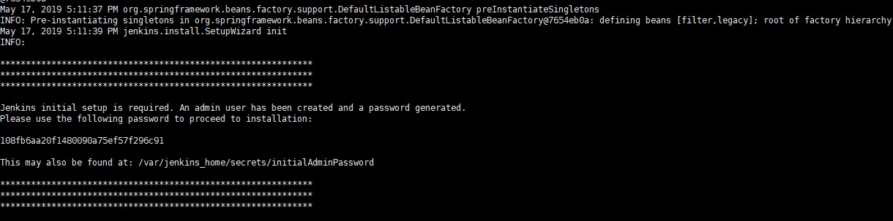

#### 安装 java 并设置环境变量

```
我有点迷，当时我是自己下载然后用ftp上传上去然后解压，后续其他方法我再试试
最好安装10.x版本
环境变量地址: vi /etc/profile
```

#### 安装 docker

```
# 安装必要的一些系统工具
sudo yum install -y yum-utils device-mapper-persistent-data lvm2

# 添加软件源
sudo yum-config-manager --add-repo http://mirrors.aliyun.com/docker-ce/linux/centos/docker-ce.repo

# 添加软国内软件源
sudo yum-config-manager --add-repo https://download.docker.com/linux/centos/docker-ce.repo

# 官网推荐
# 更新并安装Docker-CE
sudo yum install docker-ce docker-ce-cli containerd.io
```

#### 然后安装 jenkins 镜像

```
# 查看安装镜像
docker image ls

# 安装jenkins镜像
docker pull jenkinsci/blueocean

# 创建一个jenkins目录
mkdir /home/jenkins_home

# 启动一个jenkins容器 -d后台运行
# /home/jenkins_home/:/home/jenkins_home/ 是为了做共享文件夹，从git克隆代码后然后共享到主机进行打包
# --name 自定义名字
docker run --name jenkins -p 8081:8080  -v /home/jenkins_home/:/home/jenkins_home/ jenkinsci/blueocean -d

# 启动docker 启动镜像
systemctl start docker
service docker stop #关闭docker
docker start jenkins #开启容器
docker kill #关闭容器
docker restart [container id] #重启容器

# 查看正在运行的容器
docker ps
```

成功后应该是下面这个页面


#### 查看端口是否映射成功

`docker ps -a`

#### 浏览器启动

虚拟机 IP：端口

#### 获取密钥

docker exec -it jenkins bash
