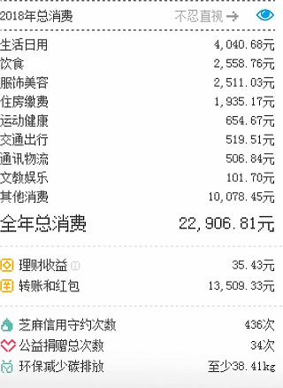
### &emsp;&emsp;我的工资都浪费在哪些地方？

#### top1 鞋子

据统计今年我总共买了四双鞋子，总共花费约800元左右，无法想象，记得以前我买了两双特步换着穿两三年才有闲钱换了新的，现在真有点膨胀，这四双鞋中，买完就后悔的有两双，首先是阿迪的这双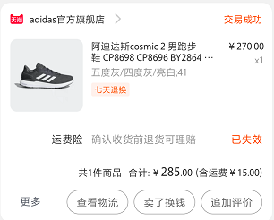不懂为什么阿迪的41号跟别家的41号不同，我穿着有一点显大而且很容易拖鞋垫，就是你大街上走着走着鞋垫就从后脚跟拖出来了...反正我现在穿它基本就不垫鞋垫了，透气性很适合春夏秋穿至于弹性还行吧跟想象的不一样，接下来是特步家的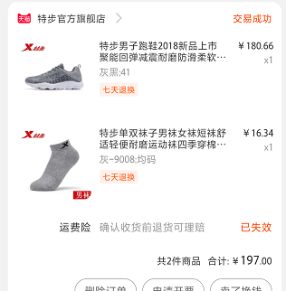,
这双鞋弹性一般透气可以质量差评，刚穿了一个月撑起鞋舌的那个穿孔就掉了- -...剩下两个还是特步家的，一个运动鞋一个老爹鞋，目前没有任何问题，穿着舒适

#### top2 烤箱和面包机

也不是不能不买，而是买了之后感觉有点用处但是有点鸡肋，18年刚工作的时候想给家里添件电器，家里其他也不缺而我当时被烘焙洗脑了就花了几百块买了个烤箱给我妈，买烤箱的目的就只有一个做面包！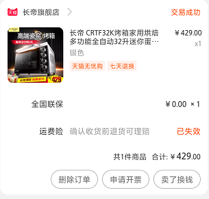但由于技术实在太菜每次都做成馒头硬的不像话，不过实话实说烤箱的质量很不错，但但是！我妈不会烘焙我也是屁股塞黄豆一窍不通，所以主要的功能就是我回家后做鸡胸肉了其余时间都在闲置着，过了一段时间不甘心的我在年中的时候买了一台面包机，这下好了傻瓜式操作，面粉和水的比例说明书都有，总算是满足了我做面包的念想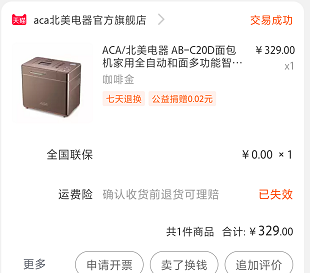,做了几次后就乏味了，成本太高味道不理想也弃了偶尔健身拿来做早餐吃也是美滋滋

#### top3 质量差的生活用品

没什么好解释的贪便宜买的
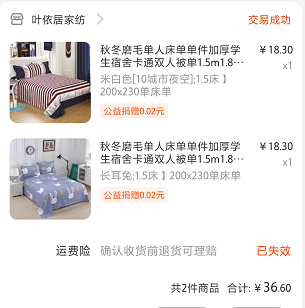
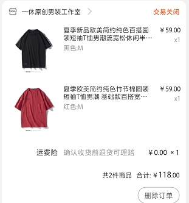
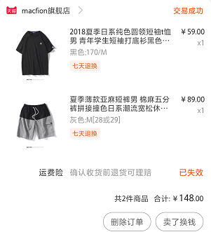
价格看起来还行，其实我是蹭了商家的活动，买一赠一，收到衣服后会返回支付款的一半，这些衣服买来之后或多或少都会出现些问题，起毛了等等等等，相比起我在优衣库买的衣服简直就是个屁

#### top4 伪文艺小清新生活用品

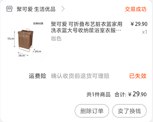记得在淘宝上第一眼看见就喜欢的不得了，买来之后也装了几天衣服后来因为被褥枕头太多就当成集装箱用了.....还有一些瓶子笔盒什么的我都不知道自己当时脑子怎么想的，我还在屋子里用塑料杯种了一些草....

#### top5 健身之类的..

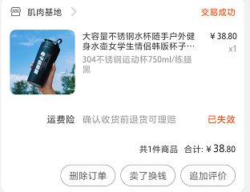
觉得好酷炫就买了，结果还不如我原先是用过的杯子...

#### top6 电锅

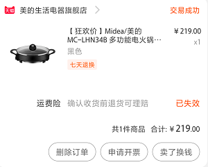
从此我知道了宁愿买电磁炉加铁锅也不能买电锅，再买吃一吨屎！

#### top7 住宿

以后再租房的话不会再租这么贵了，一年光房租花了我1W7.8